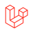
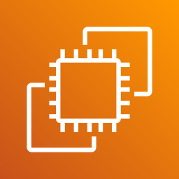
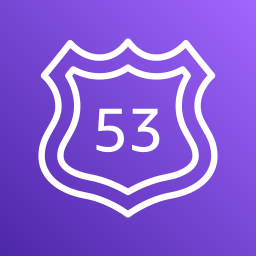

<!-- Banner -->

  

<!-- Role pills -->

  
  
  

<!-- Status pill -->

  

<!-- Typing headline -->

  

<!-- Socials + profile views -->

  
  
  

  

<!-- Animated section heading: About -->

  

Software Engineer based in **Pakistan** — 3+ years of practice, 20+ projects delivered.

- Ship across the stack: **React / Next.js** frontends, **Node / Laravel / Python** backends, **Solidity** contracts.
- Deliver SaaS platforms, ERPs, APIs, and blockchain systems end-to-end — from schema design to production deploys.
- 🟢 **Open to work** — MVP builds, team augmentation, and specialized marketplace / SaaS / Web3 engineering.
- Portfolio → **[abbasraza.dev](https://abbasraza.dev)** &nbsp;·&nbsp; LinkedIn → **[abbas-raza-naqvi](https://www.linkedin.com/in/abbas-raza-naqvi)**

  

<!-- Animated section heading: Tech -->

  

  
  
  
  
  
  
  
  
  
  

  
  
  
  
  
  
  
  

  
  
  
  
  
  
  
  

<!-- Branded icons fetched from each tool's official site -->

  
  &nbsp;
  
  &nbsp;
  
  &nbsp;
  
  &nbsp;
  
  &nbsp;
  

  
  &nbsp;
  
  &nbsp;
  
  &nbsp;
  
  &nbsp;
  
  &nbsp;
  

<!-- DevOps / hosting extras -->

  
  &nbsp;
  
  &nbsp;
  
  &nbsp;
  
  &nbsp;
  
  &nbsp;
  

<!-- Blockchain ecosystem -->

  
  &nbsp;
  
  &nbsp;
  
  &nbsp;
  
  &nbsp;
  

  

<!-- Animated section heading: GitHub stats -->

  

  
  

  

<!-- Animated section heading: Activity -->

  

  

  

<!--
  Trophies section — disabled because github-profile-trophy.vercel.app is
  currently returning 503 (DEPLOYMENT_PAUSED). Uncomment to re-enable once
  the upstream service is back.

  

    
  

  

    
  

-->

  

